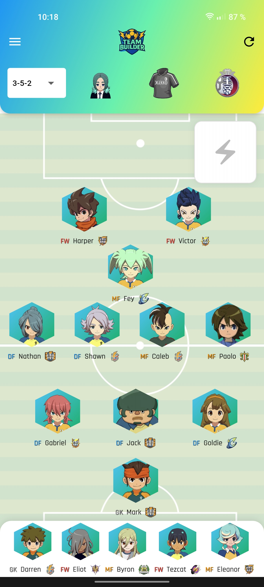
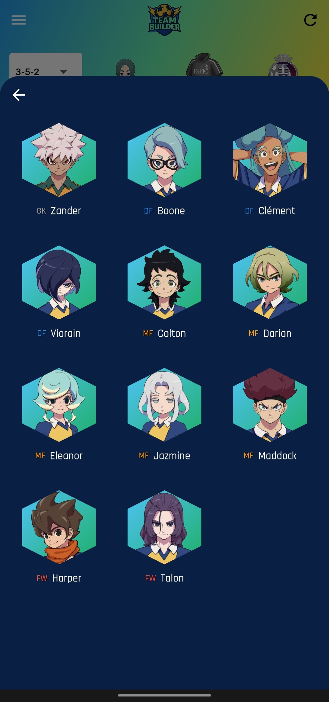
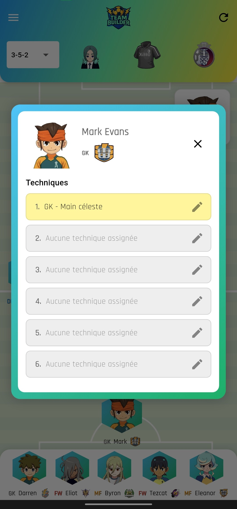
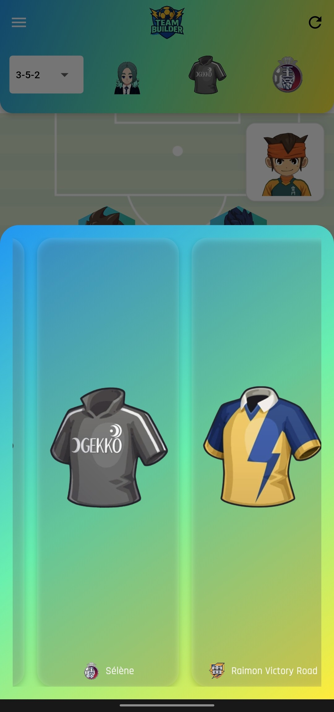

# ⚡ Inazuma Eleven Team Builder ⚡

Construis ton équipe de rêve avec tes joueurs préférés d’**Inazuma Eleven** !  
Cette application Flutter te permet de gérer tes compositions, sélectionner les techniques de chaque joueur et personnaliser ton équipe comme dans le jeu.  
Elle est développé en partenariat avec inazuma-eleven.fr

---

## ✨ Fonctionnalités

- 📝 **Gestion des joueurs** : ajoute, modifie et supprime facilement tes joueurs.  
- 🎯 **Techniques personnalisées** : choisis jusqu’à 6 techniques par joueur.  
- 🎨 **Personnalisation** : sélectionne ton coach, ton maillot et ton écusson.  
- 💾 **Sauvegarde locale** : toutes tes données sont enregistrées via `shared_preferences`.  
- 📱 **Interface moderne** avec un design inspiré de l’univers Inazuma Eleven.  

---

## 📸 Captures d’écran

| Écran principal | Sélection joueurs |
|-----------------|---------------|
|  |  |

| Sélection technique | Sélection maillots |
|---------------------|-----------------------|
|  |  |

---

## 🛠️ Installation

1. Clone le repo :
   ```bash
   git clone https://github.com/ton-compte/inazuma_eleven_team_builder.git
